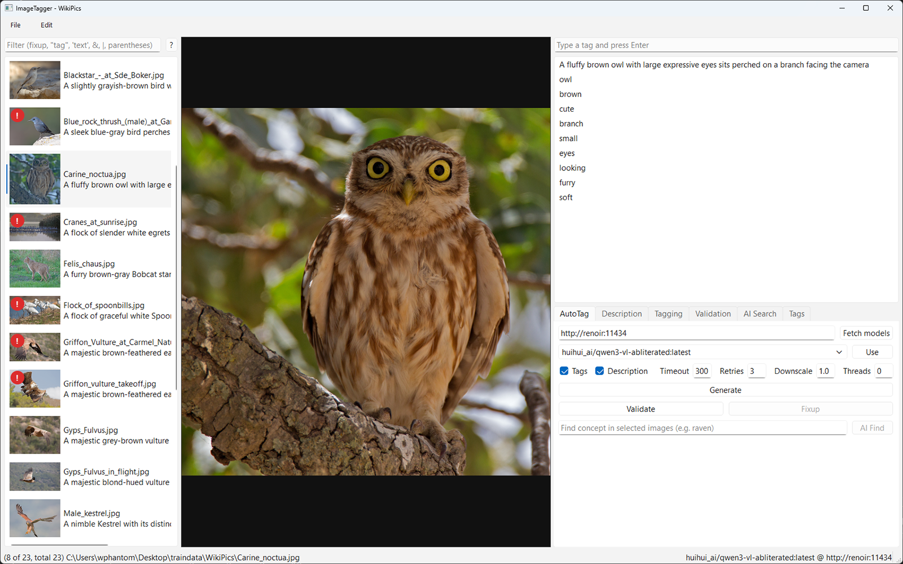
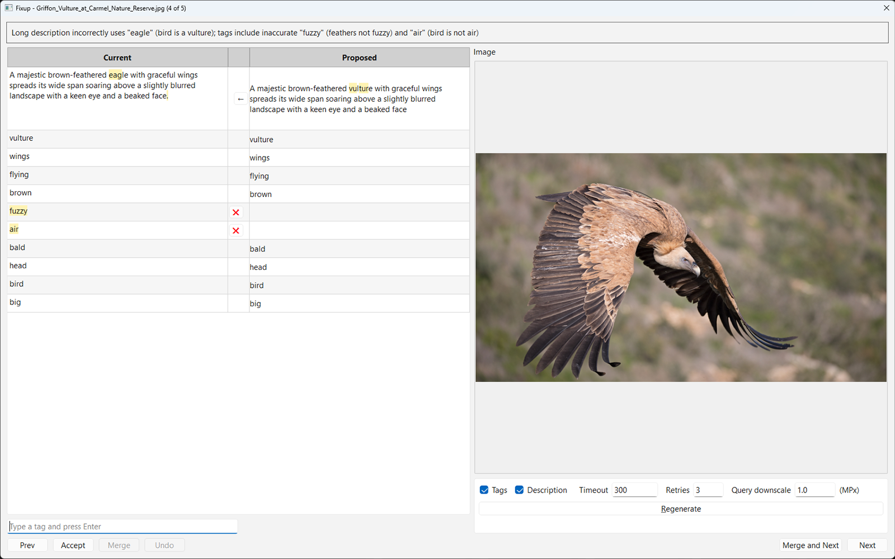

# ImageTagger

ImageTagger is a desktop annotation tool for image/text pairs, built with PyQt6 for ML dataset curation workflows.

It is designed for teams and solo practitioners who need to keep large caption/tag corpora clean, consistent, and model-ready.

## Quick Start

Prerequisite: Python 3.9 or newer in PATH.

Windows:

1. Double-click `install.bat` (or run it from a terminal).
2. Double-click `run.bat` to launch.

Linux / macOS:

1. `chmod +x install.sh run.sh update.sh`
2. `./install.sh`
3. `./run.sh`

To update dependencies later: run `update.bat` (Windows) or `./update.sh` (Linux/macOS).

Then:

1. Open a folder containing images.
2. Start an LLM server endpoint:
	- Ollama (default): https://ollama.com on port 11434.
	- OpenAI-compatible server (for example vLLM) on a non-11434 port such as 8000.
3. Enter the endpoint and fetch models.
4. Qwen3-VL-8B is the current recommended model for the best practical performance/quality balance.
5. Select one or more images.
6. Generate, validate, and resolve fixups.

Supported image formats: jpg, jpeg, png, bmp, gif, webp.

## Documentation

- Docs index: [docs/README.md](docs/README.md)
- Full usage guide: [docs/usage.md](docs/usage.md)
- Ollama settings: [docs/ollama_settings.md](docs/ollama_settings.md)
- Screenshots: [docs/screenshots/main_window.png](docs/screenshots/main_window.png), [docs/screenshots/merge_dialog.png](docs/screenshots/merge_dialog.png)

## Highlights

- Batch operations on selected images for Generate, Validate, and AI Find.
- Fixup workflow backed by per-image .fixup files.
- Expression-based filtering with fixup, untagged, resolution, quoted tags, freetext, NOT/AND/OR, and parentheses.
- Editable prompt tabs for Description, Tagging, Validation, and AI Search.
- Preview context menu with Open in Default App and Open With support.

## Screenshots

Main window:

Merge dialog:

## Acknowledgement and Inspiration

This project is heavily inspired by TagGUI.

TagGUI deserves full credit for the core UI layout direction and practical workflow ideas.

## AI Generation Disclosure

For transparency and legal disclosure, this codebase was 100% AI-generated with GitHub Copilot.
