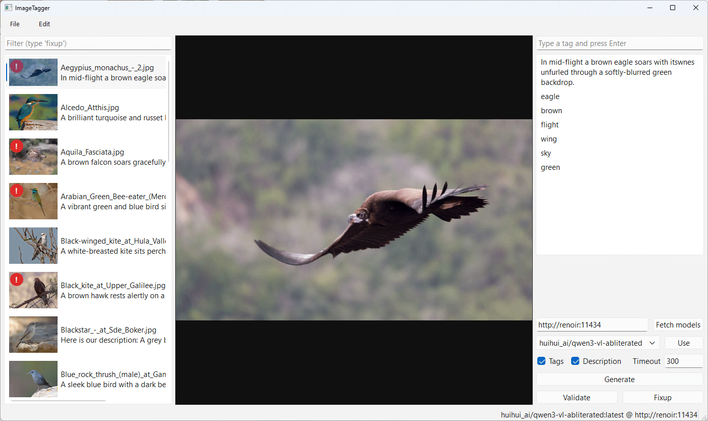
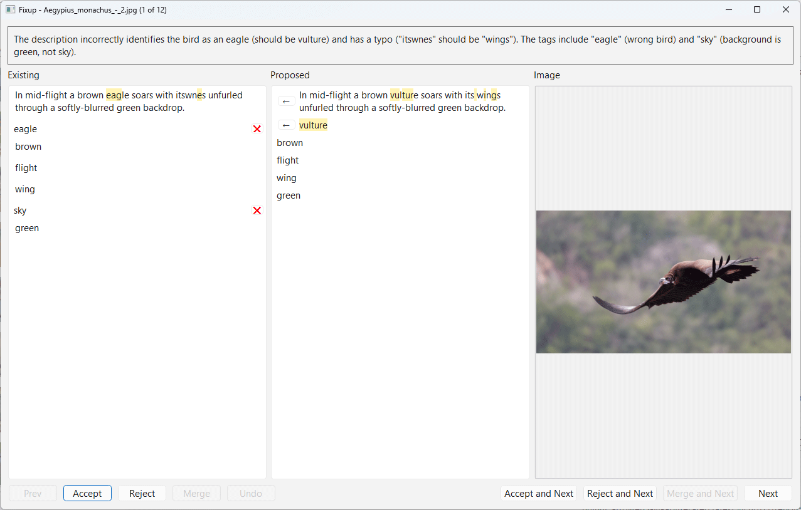

# ImageTagger

ImageTagger is a desktop annotation tool for image and text pairs, built with PyQt6 and aimed at ML dataset curation workflows.

It is designed for teams and solo practitioners who need to keep large image caption or tagging corpora clean, consistent, and model-ready.

## Who This Is For

- ML engineers maintaining image-caption or image-tag datasets.
- Researchers running iterative dataset cleanup before training or fine-tuning.
- Synthetic data and LoRA pipeline builders who need fast human-in-the-loop correction.
- Small teams that prefer local desktop workflows over heavier annotation platforms.

## Acknowledgement and Inspiration

This project is heavily inspired by TagGUI.

TagGUI deserves full credit for the core UI layout direction and practical workflow ideas. Without that foundation and inspiration, this project in its current form would likely not exist.

## What ImageTagger Focuses On

- Fast 3-pane workflow:
  - Left: image list with thumbnails and quick preview text.
  - Center: large image preview.
  - Right: tag input, editable annotations, generation, validation, and fixup actions.
- File-paired annotation editing for image and txt sidecar files used in dataset pipelines.
- Ollama connectivity for local or remote model workflows.
- Batch generation for tags and description text.
- Validation pipeline for existing annotations, with practical support for dataset hygiene at scale.
- Merge-based fixup dialog to apply corrections safely before writing them back.

## Important Difference vs TagGUI

ImageTagger is intentionally smaller in scope today.

It does not currently implement advanced tag operations available in TagGUI, such as regex-based tag filtering, tag replacement flows, and related power-user tag tooling.

These advanced features are good candidates for future development and may be added later.

## What ImageTagger Adds Beyond the Original Inspiration

The biggest extension is deep Ollama integration.

- You can connect to an Ollama server and choose models directly in the app.
- You can generate tags and richer descriptions with model-driven flexibility that the original inspiration did not provide.
- You can validate existing annotations at scale, which is especially useful when large datasets accumulate noisy, inconsistent, or drifting descriptions over time.

## Recommended Model (Current Experience)

Based on current project usage, the best observed balance of performance and annotation accuracy has been with Qwen3-VL 8B.

It also fits very well on consumer GPUs with 16GB VRAM, making it a practical default choice for local workflows.

## Validation and Merge Workflow

Validation is designed as practical maintenance tooling, not just a one-shot checker.

- It helps identify annotation issues early and continuously.
- It supports iterative cleanup for large image and description collections.
- It reduces manual churn when curating training corpora across long-running projects.
- The merge feature offers a convenient review step to fix improper descriptions and apply corrections with control.

## Screenshots

### Main Window

In the image list, the red exclamation mark on a thumbnail indicates that validation found issues in that image's description or tags and a fixup is available.

### Merge Dialog

The merge dialog provides a fast way to review proposed corrections and resolve description or tag issues with controlled accept, reject, merge, and next-step actions.

## Platform Notes

ImageTagger is expected to be cross-platform because it is built with Python and PyQt6.

At this stage, development and routine usage have focused on Windows. Linux and macOS support is presumed, but it has not been tested thoroughly yet.

## AI Generation Disclosure

For transparency and legal disclosure, this codebase was 100% AI-generated with GitHub Copilot.

## File Pairing

For each image, the app looks for a txt file with the same base name.

Example:

- photo01.jpg
- photo01.txt

If the txt file does not exist, it is created when a save operation occurs.

## Quick Start

Windows PowerShell:

1. python -m venv .venv
2. .\.venv\Scripts\Activate.ps1
3. pip install -r requirements.txt
4. python run.py

Then:

1. Open a folder containing images.
2. Connect to Ollama and choose a model.
3. Edit, generate, validate, and merge annotations as needed.
4. Use validation and merge iteratively to improve annotation quality before downstream training.

Supported image formats: jpg, jpeg, png, bmp, gif, webp.
