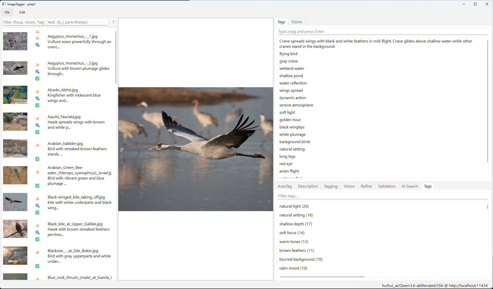
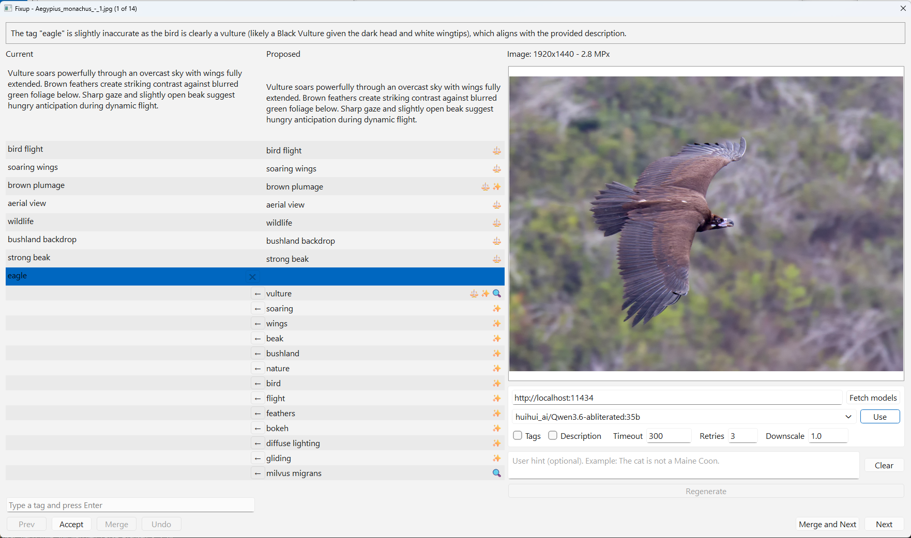

# ImageTagger

**Turn raw images into clean, model-ready annotations — powered by local AI, reviewed by you.**

ImageTagger is a desktop tool for building and curating image caption and tag datasets. It pairs a fast visual browser with an AI-assisted fixup workflow, so you can generate, validate, and correct annotations at scale without ever leaving your machine.

Built with PyQt6. Runs on Windows, Linux, and macOS.

---

## Screenshots

**Main window** — browse your dataset, review AI-generated tags and descriptions, filter by annotation status, and launch batch operations:



**Merge dialog** — a side-by-side diff view for reviewing and accepting AI-proposed fixes before they land in your files:



---

## Why ImageTagger?

- **Dual-purpose annotations.** Tags and short captions for **diffusion training** (LoRA, SDXL, Flux). High-density VLM captions with chain-of-thought reasoning for **vision language model training** — ready to drop into an [Unsloth](https://github.com/unslothai/unsloth) fine-tuning dataset.
- **Local and private.** Works with [Ollama](https://ollama.com) or any OpenAI-compatible API. Your images never leave your machine.
- **Batch-first.** Select any number of images and run Generate, Validate, or AI Find in one shot.
- **Human in the loop.** The fixup workflow shows exactly what the AI wants to change. You accept, reject, or edit each suggestion before it is written.
- **Smart filtering.** Expression-based filter lets you find exactly what needs attention: `fixup & "bird"`, `!validated & resolution > 5`, `untagged | 'blurry'`.
- **Annotation status at a glance.** Each image in the list carries status badges — ⚖️ fixup pending (from Validate), ✨ vision/refine data ready (from Generate with Refine), 🔍 matched by AI Find, ✅ validated (from Validate or user merge) — so you always know what still needs work. Hover a ✅ image to see who validated it and when: model name or "user", plus the date.
- **Customizable prompts.** Edit every workflow prompt (Tags, Description, Validation, AI Search, Vision, Refine) directly in the app. Each tab has an agent role field ("You are ..."), a Test button to see the full rendered prompt and model response against any image, and Apply / Save / Reset controls.

---

## Features

| Feature | Details |
|---|---|
| **Generate** | Batch-generate tags, descriptions, and/or VLM captions for selected images using a vision LLM |
| **Vision / Refine** | Generate high-density captions with chain-of-thought reasoning for VLM training — stored separately from diffusion tags, exportable to [Unsloth](https://github.com/unslothai/unsloth) datasets |
| **Validate** | Run the AI over existing annotations and write fixup data into each image's sidecar for anything that needs correction |
| **AI Find** | Search your dataset by concept — the AI scans selected images and marks matches |
| **Fixup / Merge** | Visual diff dialog for reviewing AI-proposed changes before accepting them |
| **Expression filter** | `fixup`, `untagged`, `resolution </>`, `"tag"`, `'text'`, `NOT` / `AND` / `OR`, parentheses |
| **Prompt editor** | Per-tab prompt editing with Apply, Save, Reset, and Test buttons |
| **Regenerate in-dialog** | Switch model or prompt mid-review and regenerate fresh candidates without leaving the merge dialog |
| **External editors** | Open With context menu auto-detects installed image editors |
| **Auto thread mode** | Adaptive parallelism for Ollama — ramps up threads as GPU headroom allows |
| **Cross-platform** | Windows, Linux, macOS — one-step install and run scripts included |

---

## Quick Start

**Prerequisite:** Python 3.9 or newer on your PATH.

### Windows
```
install.bat   # first time only
run.bat
```

### Linux / macOS
```bash
chmod +x install.sh run.sh update.sh
./install.sh   # first time only
./run.sh
```

To update dependencies later: `update.bat` or `./update.sh`.

### First steps after launch

1. **File → Open Folder** — point ImageTagger at a directory of images.
2. Connect to an LLM server:
   - [Ollama](https://ollama.com) on `http://localhost:11434` (default), or
   - any OpenAI-compatible server (e.g. vLLM) on a custom port.
3. Fetch models and select one. **Recommended: Qwen3-VL-8B** for the best performance/quality balance.
4. Select one or more images in the list.
5. Hit **Generate** to produce tags and descriptions, then **Validate** to catch issues.
6. Open **Fixup** to review and merge AI suggestions image by image.

**Supported formats:** jpg, jpeg, png, bmp, gif, webp.

---

## Documentation

- [Usage guide](docs/usage.md) — workflows, filter syntax, keyboard shortcuts, and more
- [Keyboard shortcuts](docs/shortcuts.md) — full cross-platform shortcut reference
- [Docs index](docs/README.md)

---

## Acknowledgements

This project is heavily inspired by [TagGUI](https://github.com/jhc13/taggui), which deserves full credit for the core UI layout direction and practical workflow ideas.

## AI Generation Disclosure

For transparency, this codebase was 100% AI-generated with GitHub Copilot.
